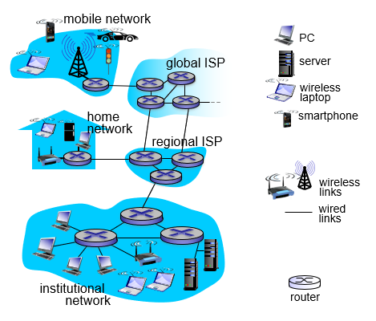
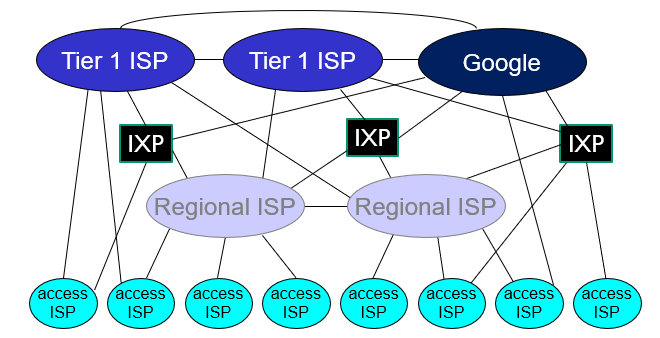
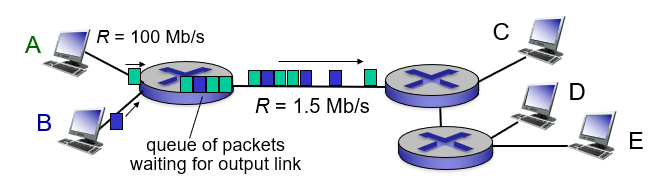
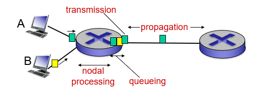
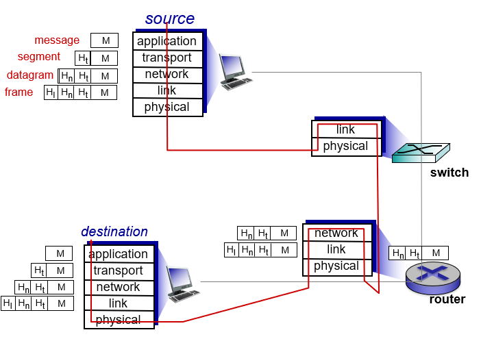

# 1. Introduction

## 1.1 What is the Internet

### Nuts and bolts view
- hosts (end systems): running network apps
- communication links
- packet switches
  - router
  - link-layer switch

(ISP: Internet Service Provider)

### Service view
- infrastructure that provides services and programming interface to apps
 
### Network of network

(IXP: Internet Exchange Point)

## 1.2 Network Edge
Access networks
- Wired
  - DSL: Digital Subscriber Line
  - Cable Internet access
  - FTTH: Fiber To The Home
  - Ethernet
- Wireless
  - wireless LANs (WiFi)
  - wide-area wireless access (3G, 4G, 5G)
  
## 1.3 Network Core
- mesh of interconnected routers
- routing and forwarding

### Packet switching
- hosts break application-layer messages into packets
- store and forward
- queueing and loss

### Circuit switching
- end to end resources allocated to, reserved for "call" between source & dest

## 1.4 Delay, Loss, Throughput in Networks
Delay
- nodal processing delay
- queue delay
- transmission delay
- propagation delay

Loss
- packet arriving to full queue dropped

Throughput
- rate (bits/time unit)

Traceroute

## 1.5 Protocol Layers
Internet protocol stack

| Internet protocol stack | Description | Packet | Example |
|-|-|-|-|
| application | supporting network apps | message | HTTP, SMTP, FTP |
| transport | process data transfer | segment | TCP, UDP |
| network | routing from source to destination | datagram | IP |
| link | data transfer between neighboring network elements |  frame | Ethernet, WiFi |
| physical | bits on the wire |

OSI reference model
|OSI reference model|
|-|
|application|
|presentation|
|session|
|transport|
|network|
|link|
|physical|

Encapsulation

## 1.6 Networks Under Attack
- Denial of Service (DoS)
- Packet sniffing
- IP spoofing