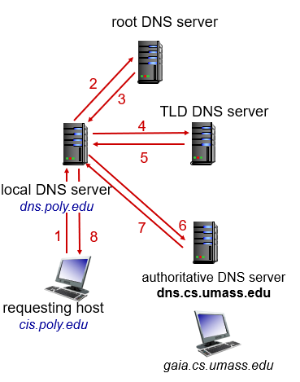
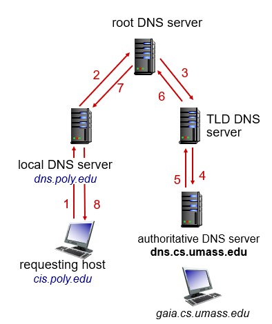

# 2. Application Layer

## 2.1 Principles

Application architecture
- client-server
- peer-to-peer (P2P)

Cross-host Communication
- client process, server process
- socket
- addressing process (IP address + port number)

Transport
- data integrity (TCP vs UDP)
- throughput
- timing
- security (SSL: Secure Sockets Layer)

| TCP | UDP |
|-|-|
| reliable transport | no |
| connection-oriented | no |
| flow control | no |
| congestion control | no |

Application Layer Protocol
- types of messages exchanges
- message syntax and semantics
- rules for when and how to process messages

## 2.2 Web and HTTP
HTTP: hypertext transfer protocol
- client-server model
- use TCP (non-persistent vs persistent)
- stateless (cookie)

Request message

Response message

Cookie

Web cache

Conditional GET

## 2.3 Email

SMTP: deliver to mail server [RFC 2821]
- use TCP
- push instead of pull (HTTP)

Mail access protocol: retrieval from mail server
- POP3: Post Office Protocol [RFC 1939]
- IMAP: Internet Mail Access Protocol [RFC 1730]

Web mail:
- deliver to sender's mail server via HTTP
- retrieve from receiver's mail server via HTTP

## 2.4 DNS
DNS: Domain Name System (application layer protocol)
- hostname to IP address translation
- host aliasing
- mail server aliasing
- load distribution

DNS distributed, hierarchical database

DNS resolution by iteration

DNS resolution by recursion

DNS record
| type | description |
|-|-|
| A | name is hostname, value is IP address |
| NS | name is domain, value is the hostname of authoritative name server for this domain | 
| CNAME | name is alias name, value is canonical name |
| MX | value is name of mailserver associated with name |

CDN