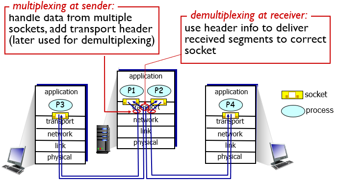
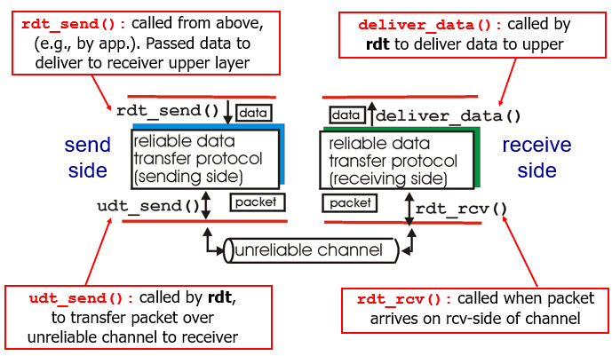
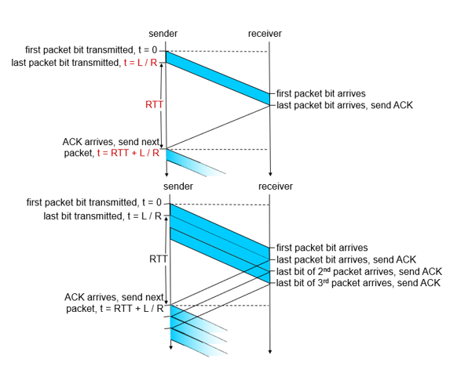
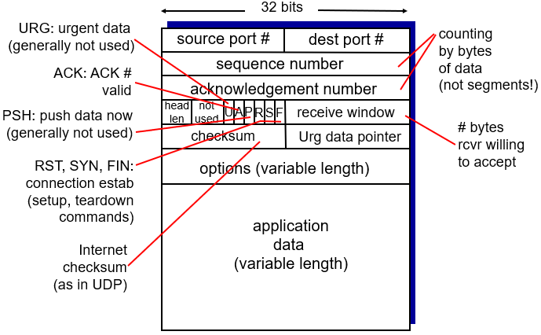
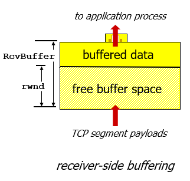
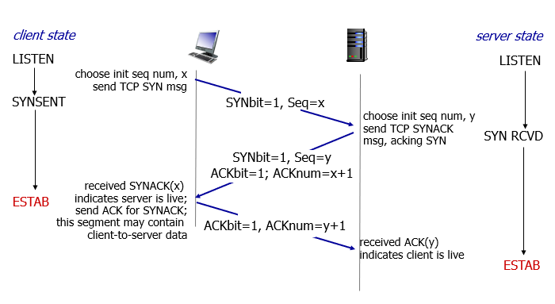
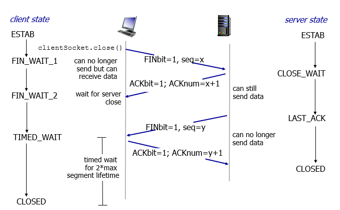

# 3. Transport Layer

## 3.1 Transport Layer Overview
- provide logical communication between app processes running on different hosts
- transport protocols run in hosts

Transport Layer vs Network Layer:
- transport layer: logical communication between processes
- network layer: logical communication between hosts

## 3.2 Multiplexing and Demultiplexing

- transport layer segment: source & destination port number
- network layer datagram: source & destination IP

Connectionless demultiplexing vs Connection-oriented demultiplexing:
- Connectionless demultiplexing socket identified by
  - dest port umber
  
  which means different source IP with same dest port will be directed to same socket at dest
- Connection-oriented demultiplexing socket identified by 4-tuple
  - source IP address
  - source port number
  - dest IP address
  - dest port number
  
  which web servers have different sockets for each connecting client (non-persistent HTTP will have different socket for each request)

## 3.3 Connectionless Transport: UDP
UDP: User Datagram Protocol [RFC 768]
- no connection establishment (which can add delay)
- simple
- small header size
- no congestion control (can blast away as fast as desired)

UDP used in
- streaming multimedia apps (loss tolerant, rate sensitive)
- DNS

UDP checksum
- detect errors in transmitted segment

## 3.4 Principles of Reliable Data Transfer
Reliable data transfer (rdt):
- important in application, transport, link layers

rdt 1.0: reliable transfer over a reliable channel

rdt 2.0: channel with bit errors
- error detection: **checksum** to detect bit errors
- feedback: control messages from receiver to sender
  - **acknowledgement (ACK)**
  - **negative acknowledgement (NAK)**
  - sender retransmits on receipt of NAK
- fatal flaw: what if ACK/NAK corrupted
  - sender retransmits if ACK/NAK corrupted
  - sender adds **sequence number** 
  - receiver discards (doesn't deliver up) duplicated
  - stop and wait: sender sends one packet then waits for receiver response

rdt 3.0: channels with errors and loss
- requires **countdown timer**
- sender retransmits if no ACK in this time
- receiver must specify sequence number on ACK
- fatal flaw: performance

Pipelined protocols:

[Go-back-N](https://media.pearsoncmg.com/ph/esm/ecs_kurose_compnetwork_8/cw/content/interactiveanimations/go-back-n-protocol/index.html) vs [Selective Repeat](https://media.pearsoncmg.com/ph/esm/ecs_kurose_compnetwork_8/cw/content/interactiveanimations/selective-repeat-protocol/index.html)

## 3.5 Principles of Congestion Control
Congestion: too many sources sending too much data too fast for network to handle
- unneeded retransmission
- upstream transmission capacity waste when packet dropped

## 3.6 Connection-oriented Transport: TCP
TCP:
- point-to-point
- full-duplex
- connection-oriented (handshaking)

### 3.6.1 Segment structure:

### 3.6.2 Flow control:
receiver controls sender so sender won't overflow receiver's buffer by transmitting too much/fast
- receiver includes rwnd (receive window) in receiver-to-sender segments
- sender limits unacked data to rwnd

### 3.6.3 Connection management

Establish a connection

Close a connection

### 3.6.4 TCP Congestion Control
- slow start
- congestion avoidance
- fast recovery
  
