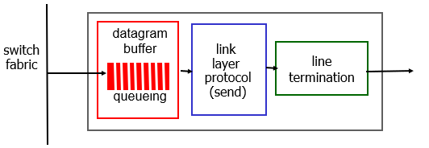
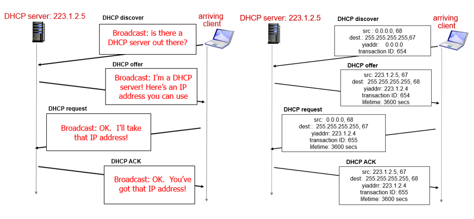

# 4. Network Layer

# 4.1 Overview
Transport segment from sending to receiving host
- on sending side encapsulates segments into datagrams
- on receiving side deliver segments to transport layer

Network layer functions:
- forwarding: move packets from router's input to appropriate router output
- routing: determine route taken by packets from source to destination (routing algorithms)

Network layer planes:
- data plane: forwarding
- control plane: routing

Network control plane's two approaches:
- per-router control

- logically centralized control

(CA: control agents)

Network layer service model:
| network architecture | service model | guarantee delivery (no loss) | guarantee bandwidth | guarantee order | guarantee timing | 
|-|-|-|-|-|-|
| Internet | best effort | no | no | no | no | 

## 4.2 Packet Switch (Router)
Architecture

Input port
- line termination (physical layer)
- link layer protocol
- decentralized switching
  - using header field values + forwarding/flow table (in input port memory) to lookup output
 
| forwarding | description | table |
|-|-|-|
| destination-based forwarding | forward based only on dest IP | forwarding table
| generalized forwarding | forward based on any set of header filed values | flow table |
  

Switching fabrics

Output port

Scheduling mechanism
- FIFO (first in first out)
- priority scheduling
- round robin scheduling

## 4.3 IP: Internet Protocol

### 4.3.1 IPv4
IP datagram format

IP fragmentation
- network links have MTU (Maximum Transmission Unit)
- large IP datagram fragmented/divided and reassembled

IP addressing
- subnet
- CIDR (Classless InterDomain Routing): a.b.c.d/x
- get IP address
  - hard-coded 
  - DHCP (Dynamic Host Configuration Protocol): using UDP

NAT: Network Address Translation
- local network uses just one IP as far as outside world is concerned
  

### 4.3.2 IPv6
IP datagram format
- no fragmentation allowed
- remove checksum

Transition from IPv4 to IPv6
- tunneling: IPv6 datagram carried as payload in IPv4 datagram among IPv4 routers

## 4.4 Generalized Forwarding and SDN (Software Defined Networking)

OpenFlow: flow table to unify different kinds of devices
- pattern match
- action

| Device | Match | Action |
|-|-|-|
| Router | longest dest IP prefix | forward out a link |
| Switch | dest NAC address | forward or flood | 
| Firewall | IP address and TCP/UCP port | permit or deny |
| NAT | IP address and port | rewrite address and port | 

## 4.5 Routing Protocols
Goal: determine "good" paths(routes) from sending hosts to receiving host, through network of routers

Classification:
- centralized/global: Link State algorithm (Dijkstra)
- decentralized: Distance Vector algorithm (Dynamic Programming)

## 4.6 Intra/Inter Autonomous System Routing Protocols
Autonomous System (AS): aggregate routers into regions, a.k.a domains

Intra-AS Routing: a.k.a IGP (Interior Gateway Protocol)
- RIP: Routing Information Protocol
- OSPF: Open Shortest Path First (use Link State algorithm)
- IGRP: Interior Gateway Routing Protocol

Inter-AS Routing: a.k.a BGP (Border Gateway Protocol)

## 4.7 ICMP: Internet Control Message Protocol
Goal: used by hosts/routes to communicate network-level info
- error reporting: unreachable host, network, port, protocol
- ICMP message carried in IP datagram
- echo request/reply (used by ping)
- TTL expired & dest port unreachable (used by Traceroute)