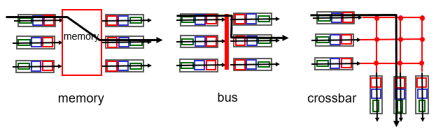
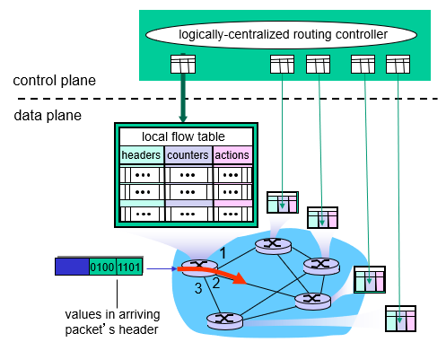

# 4. Network Layer

# 4.1 Overview
Transport segment from sending to receiving host
- on sending side encapsulates segments into datagrams
- on receiving side deliver segments to transport layer

Network layer functions:
- forwarding: move packets from router's input to appropriate router output
- routing: determine route taken by packets from source to destination (routing algorithms)

Network layer planes:
- data plane
- control plane

(CA: control agents)

Network layer service model:
| network architecture | service model | guarantee delivery (no loss) | guarantee bandwidth | guarantee order | guarantee timing | 
|-|-|-|-|-|-|
| Internet | best effort | no | no | no | no | 

## 4.2 Packet Switch (Router)
Architecture

Input port
- line termination (physical layer)
- link layer protocol
- decentralized switching
  - using header field values + forwarding table (in input port memory) to lookup output
    - destination-based forwarding: forward based only on dest IP (traditional)
    - generalized forwarding forward based on any set of header filed values
  

Switching fabrics

Output port

Scheduling mechanism
- FIFO (first in first out)
- priority scheduling
- round robin scheduling

## 4.3 IP: Internet Protocol

### 4.3.1 IPv4
IP datagram format

IP fragmentation
- network links have MTU (Maximum Transmission Unit)
- large IP datagram fragmented/divided and reassembled

IP addressing
- subnet
- CIDR (Classless InterDomain Routing): a.b.c.d/x
- get IP address
  - hard-coded 
  - DHCP (Dynamic Host Configuration Protocol): using UDP

NAT: Network Address Translation
- local network uses just one IP as far as outside world is concerned
  

### 4.3.2 IPv6
IP datagram format
- no fragmentation allowed
- remove checksum

Transition from IPv4 to IPv6
- tunneling: IPv6 datagram carried as payload in IPv4 datagram among IPv4 routers

## 4.4 Generalized Forwarding and SDN (Software Defined Networking)

OpenFlow: flow table to unify different kinds of devices
- pattern match
- action

| Device | Match | Action |
|-|-|-|
| Router | longest dest IP prefix | forward out a link |
| Switch | dest NAC address | forward or flood | 
| Firewall | IP address and TCP/UCP port | permit or deny |
| NAT | IP address and port | rewrite address and port | 

