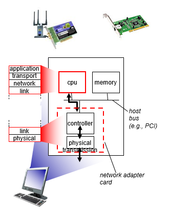
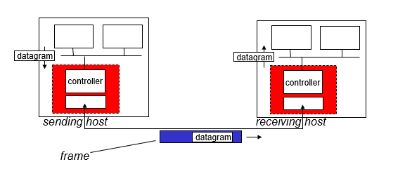
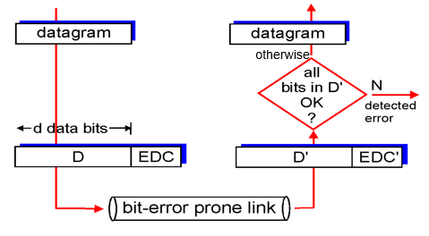
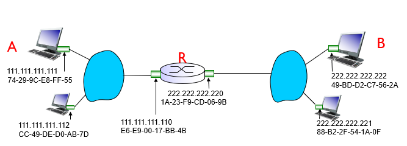

# 5. Link Layer

## 5.1 Introduction

Link Layer has responsibility of transferring datagram from one node to physically adjacent node over a link.

Link Layer services:
- framing: encapsulate datagram into frame (header)
- multiple access links
- reliable delivery
- error detection & correction

Implementation: network adapter (aka network interface card)

| sending side | receiving side |
|-|-|
| encapsulates datagram in frame | looks for errors, rdt, flow control, etc |
| adds error checking bits, rdt, flow control, etc | extract datagram, passes to upper later at receiving side | 

## 5.2 Error Detection & Correction

EDC = Error Detection and Correction bits
D = data protected by error checking

- parity check
- checksum check
- cyclic redundancy check (CRC)

## 5.3 Multiple Access Protocols
Problem: two or more simultaneous transmission between nodes in single shared channel brings *collision*

Multiple Access Protocol provides distributed algorithm that determines how nodes share channel

### 5.3.1 chanel partitioning
- divide channel into smaller "pieces"
- allocate pieces to node for exclusive use

Protocols:
- TDMA: time division multiple access
- FDMA: frequency division multiple access
- CDMA: code division multiple access

### 5.3.2 random access
- channel not divided, allow collisions
- detect and recover (delayed retransmission) from collisions

Protocols:
- Slotted/Unslotted ALOHA
- CSMA: carrier sense multiple access
- CSMA/CD (collision detection)

### 5.3.3 taking turns
- nodes take turns, but nodes with more to send can take longer turns

Protocols:
- polling
- token passing

## 5.4 LANs

### 5.4.1 MAC addresses & ARP
MAC address, aka LAN address, physical address:
- 48 bit
- administered by IEEE

ARP: IP/MAC mapping
- IP address; MAC address, TTL
- in same LAN: broadcast ARP query

### 5.4.2 Ethernet
Widely used wired LAN technology.

Ethernet frame:

- addresses: adapter discards frame with unmatched dest address (broadcast)
- type: indicate higher layer protocol (mostly IP)
- CRC: cyclic redundancy check: drop frame if error detected

### 5.4.3 Switch
Switch:
- link-layer device
  - store and forward frames
  - examine incoming frame's MAC, selectively forward to outgoing links
- plug and play, self learning
  - switch not need to be configured