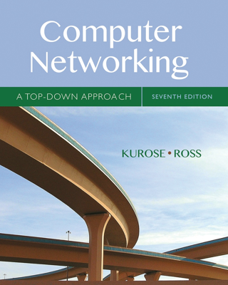

# computer-networking
Summaries and notes from *Computer Networking (A TOP-DOWN APPROACH)*

1. [Introduction](./1-introduction/README.md)
2. [Application Layer](./2-application-layer/README.md)

https://media.pearsoncmg.com/bc/abp/cs-resources/products/product.html#student,isbn=0136681557